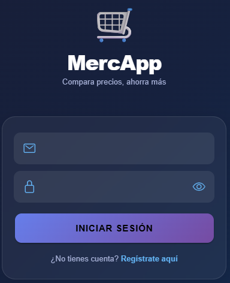

# 🛒 MercApp

> Compara precios de supermercados en Colombia y ahorra en cada mercado.



---

##  ¿Qué es MercApp?

MercApp es una aplicación móvil que permite a los usuarios colombianos comparar precios de productos entre **Olímpica** y **Éxito**, planear su mercado inteligentemente y calcular descuentos en tiempo real.

---

##  Funcionalidades

| Feature | Descripción |
|---|---|
|  **Comparador de precios** | Busca cualquier producto y compara precios entre Olímpica y Éxito agrupados por presentación |
|  **Calculadora de descuentos** | Ingresa el precio y el % de descuento y calcula cuánto ahorras |
|  **Planea tu mercado** | Arma tu lista de compras y la app te dice dónde comprar cada ítem más barato |
|  **Cámara** | Toma fotos de productos o tickets desde la app |
|  **Panel Premium** | Estadísticas avanzadas y top diferencias de precio entre tiendas |
|  **Panel Admin** | CRUD completo de productos con gestión por segmento |
|  **Pagos con PayPal** | Upgrade a Premium desde la app con PayPal Sandbox |

---

##  Stack Tecnológico

### Frontend
- **Ionic 7** + **Angular 20** (Standalone Components)
- **Capacitor** para acceso a hardware nativo (cámara, almacenamiento)

### Backend
- **FastAPI** (Python) — desplegado en Render
- **PostgreSQL** — base de datos en Neon
- Autenticación con hash **SHA-256**

### Servicios externos
- **PayPal Sandbox** — pasarela de pagos
- **Render** — hosting del backend
- **Neon** — base de datos serverless

---

##  Instalación local
```bash
# 1. Clonar el repositorio
git clone https://github.com/tu-usuario/mercapp.git
cd mercapp

# 2. Instalar dependencias
npm install --legacy-peer-deps

# 3. Correr en navegador
ionic serve

# 4. Generar APK
ionic build
npx cap sync android
npx cap open android
```

---

##  API Endpoints

Base URL: `https://mercapp-backend-final.onrender.com`

| Método | Endpoint | Descripción |
|---|---|---|
| `GET` | `/productos?nombre=xxx` | Buscar productos |
| `GET` | `/productos/comparar?nombre=xxx` | Comparar por presentación |
| `POST` | `/productos` | Agregar producto |
| `PUT` | `/productos/{id}` | Actualizar producto |
| `DELETE` | `/productos/{id}` | Eliminar producto |
| `POST` | `/login` | Iniciar sesión |
| `POST` | `/register` | Registrar usuario |
| `POST` | `/planear-mercado` | Recomendaciones por lista |

---

##  Roles

| Rol | Acceso |
|---|---|
| `basic` | Comparador, calculadora, mercado |
| `premium` | Todo + panel de estadísticas |
| `admin` | Todo + CRUD de productos |

---

##  Próximas mejoras

- [V1.1] Web scraping automático para precios en tiempo real
- [ ] Crowdsourcing — usuarios reportan precios
- [ ] Notificaciones cuando baja el precio de un favorito
- [ ] Soporte para más tiendas (Jumbo, Carulla, D1)

---

##  Licencia

Copyright (c) 2026 — Ver archivo [LICENSE](LICENSE)

---

*MercApp — Porque cada peso cuenta 🇨🇴*
```


Copyright (c) 2025 [Rebeca Pedrozo Cueto]

